# Jornada DevOps de Elite

## Aula 1

- 5 aulas com desafios
- Aprender DevOps requer método, e não tutoriais esparços. É necessário conhecer os fundamentos.
- Cultura DevOps: modelo CALMS (Culture, Automation, Lean, Measurement and Sharing)
  - Cultura: mudança de pensamento nas empresas, promovendo colaboração entre as equipes e autonomia aos times de infra e desenvolvimento.
    - Culpa compartilhada, ou não tem culpa, todos são responsáveis e estão aprendendo
  - Lean: gestão ágil, processo dinâmico de entrega ao cliente
  - Métricas: ajudam na otimização do processo e do próprio software
  - Sharing: diálogos como o que é feito, como é reparado, justificativa de uso de determinada ferramenta. Equipes trocam conhecimento e experiências.

- Método waterfall (cascata) distancia muito o projeto da entrega final ao cliente.
- Engenheiro DevOps é uma das profissões mais procuradas no Brasil. E há poucos no mercado.
  - O valor que este profissional agrega é essencial: empresas estão migrando para a nuvem
- DevOps não é um cargo, mas uma filosofia.
  - Seus conhecimentos não são restritos a quem trabalha exatamente com isso, mas se estende a devs e QAs, que precisam aprender.

### Docker

- Como já sei, não vou fazer muitas anotações.
- Arquitetura do Docker
  - Docker daemon: gerencia os objetos do Docker (containers, imagens, redes e volumes). É onde os containers são executados.
  - Docker client (CLI) - interface de controle do docker daemon. Não precisa estar na mesma máquina que ele.
  - Docker registry: repositório que armazena as imagens.

#### Principais comandos

- ```bash
  docker container run hello-world
  ```

  - Executa um container. Faz pull da imagem se ela não existir localmente.
  - `--name` para dar um nome ao container (senão o Docker cria um aleatório)
  - `--rm` para que o container se exclua automaticamente ao ser parado
  - `--it` para o modo interativo
  - `-d` para rodar em background, sem travar o terminal.

- ```bash
  docker container ls
  ```

  - Exibe os containers em execução
  - `-a` para também mostrar os containers parados

- ```bash
  docker container rm <id>
  ```

  - Inserir o id ou o nome para remover o container. 
  - Ele precisa estar parado para isso
  - `-f` para forçar a remoção de um container que está rodando.

- ```bash
  docker container run -it -rm ubuntu /bin/bash
  ```

  - Entrar no modo interativo

- ```sh
  docker container exec -it <id> /bin/bash
  ```

  - Acessar o terminal de um container em execução.

- ```sh
  docker container run -d -p 8080:80 nginx
  ```

  - Port binding `minha-porta:porta-container`

- ```sh
  docker container run -d -p 5432:5432 -e POSTGRES_PASSWORD=12345 -e POSTGRES_USER=admin --name banco-dados-1 postgres
  ```

  - Devemos passar as variáveis de ambiente com `-e`
  - Ver a documentação oficial da imagem
  - Nas nossas imagens personalizadas, é possível criar variáveis de ambiente.

- ```dockerfile
  FROM ubuntu
  RUN apt update
  RUN apt install curl --yes
  ```

- ```sh
  docker build -t ubuntu-curl .
  ```

  - ```sh
    docker container run -it ubuntu-curl /bin/bash
    ```

    - A imagem já vai ter o curl instalado.
    - `curl https://google.com`

- ```sh
  docker image ls
  ```

- A construção de uma imagem é feita por camadas. Ao executar um novo build, somente as camadas necessárias são refeitas.

  - Cada comando no Dockerfile é uma camada.
  - A imagem é sempre read-only
  - Alterar a ordem das camadas faz o cache ser perdido e as camadas inferiores são refeitas.

- **Cuidado**. No exemplo acima, `apt update` e os comandos de instalação estão em linhas diferentes. Neste caso, o *cache pode te prejudicar*, pois o `apt update` não será executado a cada build, e o pacote pode não ser encontrado por ser muito recente. É boa prática adicionar o `apt update` antes de cada comando de instalação.

  - ```dockerfile
    FROM ubuntu
    RUN apt update && apt install git vim curl --yes
    ```

- ```sh
  docker image prune
  ```

  - Remove as imagens desnecessárias que foram criadas durante o build

  - Como a imagem é um filesystem read-only, e o container é uma camada de leitura e escrita acima desta imagem, não é possível remover uma imagem que está sendo utilizada por um container.

  - ```sh
    docker image rm nginx ubuntu
    ```

- 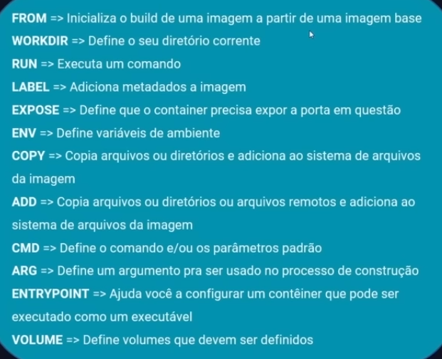

#### Docker registry

- Repositório de imagens. Ex.: DockerHub, AWS ECR, Gitlab CR

- ```
  docker login
  ```

- Importante: padrão de nomenclatura de imagens do DockerHub

  - `namespace/repositorio:versao`
  - `otaviodioscanio/api-conversao:latest`

- É boa prática sempre criar e subir a tag latest.

- ```sh
  docker build -t otaviodioscanio/ubuntu-curl:v1 .
  docker tag otaviodioscanio/ubuntu-curl:v1 otaviodioscanio/ubuntu-curl:latest
  ```

- ```sh
  docker push otaviodioscanio/ubuntu-curl:v1
  docker push otaviodioscanio/ubuntu-curl:latest
  ```

  - Envia as camadas inexistentes no DockerHub

### Projeto: Conversão de Temperatura

- https://github.com/KubeDev/conversao-temperatura

- ```dockerfile
  # Imagem base sempre deve ser versionada, para garantir sempre o mesmo comportamento se a latest mudar.
  FROM node:18.11.0
  # Criar um diretório e entrar em seguida
  WORKDIR /app 
  # Instalar os pacotes do Node JS (que estão no package.json). Copiamos o package.json separado dos demais arquivos.
  COPY package*.json ./
  RUN npm install
  # Copiar depois porque é mais comum modificar o código fonte do que as dependências
  COPY . .
  EXPOSE 8080
  CMD ["node", "server.js"]
  ```

- > sudo chown -R otavio ../../

- ```dockerfile
  docker build -t otaviodioscanio/conversao-temperatura:v1 .
  ```


## Aula 2

- Fases do ciclo DevOps:
  - **Planejamento**: definição do escopo do projeto. Usa-se ferramentas como o Jira, Slack e etc.
  - **Codificação**: etapa de desenvolvimento. Git
  - **Build**: inicia a pipeline de CI (integração contínua). Ferramentas de gerenciamento de pacote: maven, npm, nuget junto com o Docker e uma ferramenta de pipeline (Jenkins, GitHub Actions, Gitlab CI)
  - **Teste**: equipe de QA. JUnit, SonarQube
  - **Release**: gera o artefato de entrega a ser usado no deploy. Pode ser um arquivo executável, uma imagem docker, um arquivo .jar. Marca o fim da pipeline de CI
  - **Deploy**: a aplicação é entregue ao ambiente. Terraform (infraestrutura como código), Ansible (gerenciamento de configuração) e serviços de cloud, como AWS, GCP, Azure. Processo automatizado por pipelines de CD (entrega contínua).
  - **Operação**: garantia da estabilidade e de que a aplicação está no ar. É onde entra o Kubernetes.
  - **Monitoramento**: coleta de informações da aplicação e do ambiente, para futuras melhorias. Prometheus, Elastic, Grafana.

### Kubernetes

- Escalabilidade e resiliência não são tarefas do Docker.
- Indicado para aplicações de alta disponibilidade (que nunca podem cair)
- Perfeito também para cenário de microsserviços
  - Gerenciar serviços e escalar de maneira individual. Unifica em uma única ferramenta a gerência de todos os projetos.
- Cluster Kubernetes: conjunto de máquinas
  - **Kubernetes Control Plane** (master)
    - Orquestra os nodes
    - Importante ter mais de um para garantir a disponibilidade
    - 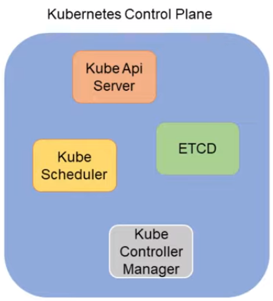
      - *Kube API Serve*r: recebe toda a comunicação para o cluster
      - *ETCD*: banco que armazena todos os dados do k8s. Não deve ser acessado sem o uso da API
      - *Kube Scheduler*: determina onde cada container vai ser executado no cluster. Verifica as especificações e quais nodes podem atender a demanda
      - *Kube Controller Manager*: gerencia todos os controladores do Kubernetes. Verifica mudanças de estado no cluster
        - Node Controller, ReplicaSet (garante o número de réplicas definido), etc.
  - **Kubernetes Nodes** (Work nodes)
    - Executam os containers da aplicação
    - 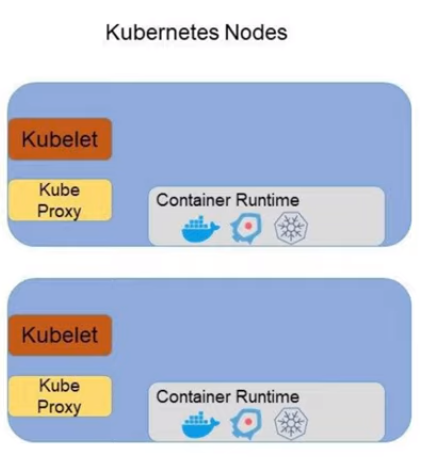
      - *Kubelet*: gestor do node, interage com o Kube API Server e garante a execução dos containers.
      - *Kube Proxy*: comunicações de rede com todo o cluster

- Usaremos o Docker para criar as imagens e executar fora do Kubernetes
  - Mas dentro do Kubernetes, o Docker não é um runtime suportado (Container-d e Cri-o são)

### Criando um cluster kubernetes

- Soluções On-Premise

  - Você tem total controle do cluster, nada é automatico.
  - Não é ideal para iniciantes

- Kubernetes como serviço

  - Control plane é gerenciado pelo cloud provider. Bom para equipes enxutas

- Kubernetes na máquina local

  - Minikube, k3s, Microk8s, Kind e K3D
  - Usaremos o K3D

- **Instalação do K3D e Kubectl**

  - Ambos são instalados por linha de comando.
  - Kubectl é a interface de comunicação com o Kubernetes
  - https://k3d.io

- ```sh
  k3d cluster create
  ```

  - Comando básico de criação de um cluster local baseado em containers docker.
  - Já cria o `/.kube/config`
  - Cria também um load balancer
  - `--no-lb` cria sem load balancer

- ```sh
  kubectl get nodes
  ```

  - Mostra os nós

- `cat /.kube/config`

  - Configurações de acesso do cluster

- ```sh
  k3d node list
  ```

  - 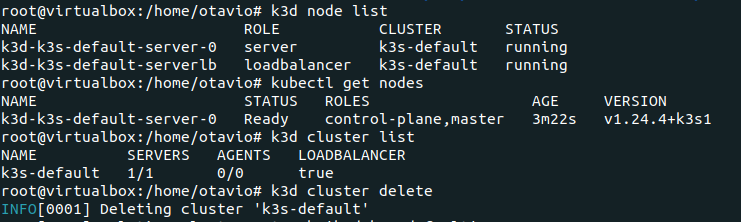

- ```sh
  k3d cluster list
  ```

- ```sh
  k3d cluster create --no-lb meucluster
  ```

  - Criar sem load balancer e com um nome

- ```sh
  k3d cluster create meucluster --servers 3 --agents 3
  ```

  - Agents são os worker nodes e servers são os control planes.

### Elementos fundamentais do cluster kubernetes

#### Pod

- Menor elemento do cluster kubernetes. É nele que os containers são executados. Funciona como uma "máquina virtual": todos os containers que rodam em um pod compartilham os mesmos recursos: filesystem e IP

  - Não coloque vários containers em um mesmo Pod. Exceto se tiver um serviço acessório executando, como uma coleta de logs.
  - Quando a aplicação for escalada, os pods são replicados, e não faz sentido replicar containers que não estão sendo demandados.
  - 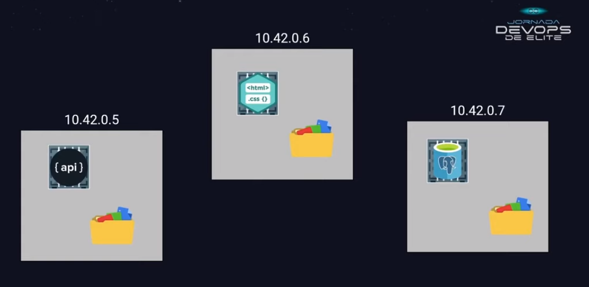

- Para criar qualquer objeto no cluster kubernetes, precisamos de um arquivo de manifesto `.yml` ou `.yaml`

  - ```yml
    # Grupo de apis que serão utilizados para o objeto (`kubectl api-resources`)
    apiVersion: v1
    kind: Pod
    metadata:
      name: meupod
    spec:
      containers:
      - name: site
        image: fabricioveronez/web-page:blue
        ports:
        - containerPort: 80
    ```

  - ```sh
    kubectl apply -f pod.yaml
    ```

    - 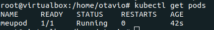
    - Ready indica a quantidade de containers

  - ```sh
    kubectl describe pod meupod
    ```

- Como acessar o pod: parecido com o port-binding do docker

  - ```sh
    kubectl port-forward pod/meupod 8080:80
    ```

    - Lembrando que a ordem das portas é host:pod
    - O pod não precisou ser criado novamente para realizar este mapeamento.

- ```sh
  kubectl delete pod meupod
  ```

  - Uma vez deletado, acabou. Precisa de um replicaset para gerenciar

- Obs: Label e selector

  - No kubernetes, interagimos com elementos por meio de labels e selectors

  - **Label**: elemento chave-valor colocado no manifesto para marcar o objeto.

    - ```yml
      # ...
      metadata:
        name: meupod-azul
        labels:
          cor: azul
      spec:
      # ...
      ```

  - **Selector**: seleciona objetos com base na label deles (que pode ser a mesma para vários).

    - ```sh
      kubectl get pods -l cor=azul
      ```

    - 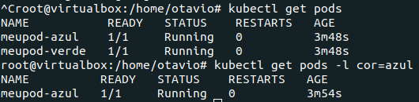

- ```sh
  kubectl delete -f pod.yaml
  ```

  - Deleta os objetos especificados no arquivo.

#### ReplicaSet 

- Garante a escalabilidade e resiliência da aplicação gerenciando os **pods**.

- Controlador que garante que o número de réplicas correntes seja igual ao número de réplicas desejadas. Ele sobe ou derruba pods.

- ```yaml
  # diferente do pod. Conferir em `kubectl api-resources`
  apiVersion: apps/v1
  kind: ReplicaSet
  metadata:
    name: meureplicaset
  spec:
    replicas: 5
    # selecionar os pods que este ReplicaSet vai gerenciar
    selector:
      matchLabels:
        app: web
    template:
      metadata:
        labels:
          cor: azul
          # deve ter o mesmo nome do seletor do ReplicaSet
          app: web
      spec:
        containers:
        - name: site
          image: fabricioveronez/web-page:blue
          ports:
          - containerPort: 80
  ```

- ```sh
  kubectl get replicaset
  ```

  - 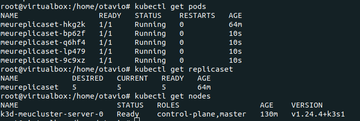

- ```sh
  kubectl describe replicaset meureplicaset
  ```

- ```
  kubectl delete pod meureplicaset-q6hf4
  ```

  - Um novo é criado em seguida

- A mudança de imagem no manifesto não reflete alteração nos pods já de pé. Ao dar um describe no ReplicaSet, vê-se que a imagem template muda, mas somente será aplicada aos novos pods.

  - Para comprovar, é possível dar um describe em um pod e verificar que ele ainda usa a imagem antiga.
  - Não faz sentido excluir manualmente os pods. Quem faz esta atualização é um outro controlador do kubernetes: o Deployment.

#### Deployment

- Gerencia as versões do ReplicaSet

- A versão nova do ReplicaSet cria pods progressivamente, enquanto a antiga perde pods. A antiga não é deletada.

- ```yml
  apiVersion: apps/v1
  kind: Deployment
  metadata:
    name: meudeployment
    # cria um replicaset de forma implícita. O nome é concatenado pois podem existir vários replicasets a partir desde deployment
  spec:
    replicas: 5
    selector:
      matchLabels:
        app: web
    template:
      metadata:
        labels:
          cor: azul
          app: web
      spec:
        containers:
        - name: site
          image: fabricioveronez/web-page:blue
          ports:
          - containerPort: 80
  ```

- Mudar a imagem muda o replicaset (gera um versionamento dele)

  - Simplesmente alterar o número de réplicas do pod não altera o replicaset (pods são simplesmente removidos e criados para atingir o valor desejado, mas não há necessidade de serem recriados, pois o molde é o mesmo)

  - **Mas, ao mudar a imagem, o deployment aplica progressivamente a nova imagem aos pods**, destruindo-os e recriando, até todos os pods serem do mesmo replicaset.

  - 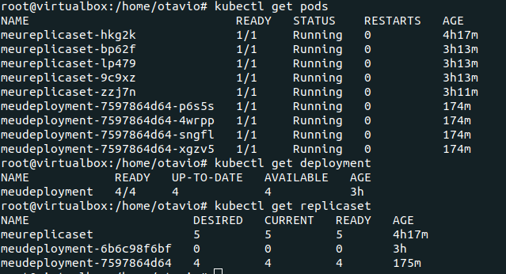

    - Repare o replicaset antigo: ele ainda existe, mas não possui pods.

    - É possível fazer o rollback para o deployment antigo com o seguinte comando:

      - ```sh
        kubectl rollout undo deployment meudeployment
        ```

      - Assim, ele recria os pods no molde antigo. 

- `kubectl port-forward pod/meudeployment-6b6c98f6bf-q7jz6 8081:80`

- Não adianta ter pods replicados se as requisições não são balanceadas entre eles. Para isto, usamos o Service.

#### Service

- É o elemento que permite a comunicação entre pods (cenário de microsserviços) e o cluster com a internet.

- Tipos de Service (há outros)

  - **ClusterIP**: gera a comunicação interna no cluster kubernetes. 
    - Possui seu IP, mas não vamos precisar usar o IP quando mexemos com containers. 
    - Não há comunicação externa.
    - 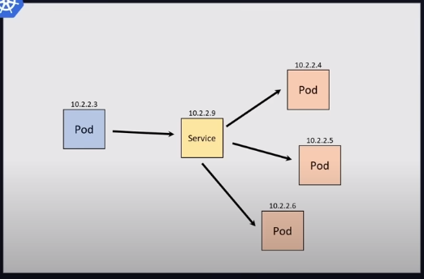
  - **NodePort**: possibilita expor os serviços externamente
    - Expõe uma porta em cada nó do cluster kubernetes.
    - Basta usar um IP de um dos nós (qualquer um) do cluster para acessar o serviço e todos os pods.
      - Ele elege uma porta entre 30000 e 32767
    - 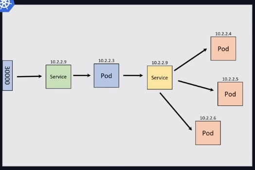
  - **LoadBalancer**
    - Service que cria um IP público para acesso a ele. É utilizado, na maioria dos casos, quando o cluster está em um provedor cloud.
    - Dá para ter em ambiente on-premise com algumas ferramentas, mas não faz tanto sentido.

- ```yaml
  apiVersion: v1
  kind: Service
  metadata:
    name: web-page
  spec:
    # todos os pods com a label web serão expostos por este serviço
    selector:
      app: web
    ports:
      - port: 80
        protocol: TCP
    type: NodePort
  ```

- ```sh
  kubectl get service
  ```

- ```sh
  k3d cluster delete meucluster
  k3d cluster create meucluster -p "8081:30000@loadbalancer"
  ```

  

> Resumo aula 2

| Comando k3d                     | O que faz                         |
| ------------------------------- | --------------------------------- |
| `k3d cluster create meucluster` | Cria um cluster com load balancer |
| `k3s cluster list`              | Mostra todos os clusters          |
| `k3d node list`                 | Lista os nós do cluster           |
| `k3d cluster delete meucluster` | Deleta um cluster                 |

| Comando kubectl                                 | O que faz                                                    |
| ----------------------------------------------- | ------------------------------------------------------------ |
| `kubectl get nodes`                             | Lista os nós do cluster com outras informações               |
| `kubectl apply -f pod.yaml`                     | Cria ou atualiza objetos com base num arquivo de manifesto   |
| `kubectl describe pod meupod`                   | Fornece informações como o nó em que o pod está executando, log de eventos, IP, porta, etc. |
| `kubectl delete pod meupod`                     | Deleta pelo nome                                             |
| `kubectl delete -f pod.yaml`                    | Deleta com base em um arquivo de manifesto (usado anteriormente para criar os objetos) |
| `kubectl get pods -l cor=azul`                  | Obtém os pods filtrando por seletor                          |
| `kubectl get replicaset`                        |                                                              |
| `kubectl describe replicaset meureplicaset`     |                                                              |
| `kubectl describe deployment meudeployment`     |                                                              |
| `kubectl rollout undo deployment meudeployment` |                                                              |
| `kubectl port-forward pod/meupod 8080:80`       |                                                              |
| `kubectl get all`                               |                                                              |

## Aula 3

#### Maneiras de configurar a infraestrutura em nuvem

- Plataforma Web (console) do cloud provider:
  - Jeito que se faz manualmente, seguindo passo a passo de cliques e configurações pelo navegador. Horrível para replicar e automatizar, sujeito a falhas humanas, difícil de explicar para alguém, etc.
- Usar comandos via CLI (terminal):
  - Já é melhor, pode fazer um shell script, é possível replicar.
  - Mas precisa tomar cuidado com a ordem de execução, verificar se o elemento já existe, etc.
  - Dá para usar uma linguagem de programação via SDK (Azure SDK, AWS SDK, GCP SDk, etc.). 
  - Instruções executadas de forma muito interativa
- Infraestrutura como código
  - O Terraform trabalha como forma declarativo: você declara o que quer que seja criado e ele cuida disso por baixo dos panos
    - Ferramenta mais usada do mercado, multi-cloud
  - A própria declaração da infraestrutura se torna documentação do projeto.
  - Fácil de replicar, distribuir, etc.

### Terraform 

- Possui plugins para cada Cloud Provider

  - É possível, inclusive, ter mais de um Cloud Provider no mesmo projeto.

- Terraform vs Ansible

  - Os dois, na realidade, se complementam

  - | Terraform - provisionamento de infraestrutura | Ansible - gerenciamento de configuração      |
    | --------------------------------------------- | -------------------------------------------- |
    | Declara os elementos da Infraestrutura        | Configura os elementos da infraestrutura     |
    | Está relacionado à criação de recursos        | Está relacionado à configuração de recursos. |

- Linguagem usada: Hashicorp Configuration Language

  - Criação do bloco:

    - Block Type
    - Block Label: nomeações e subtipos do block type. Quantidade varia conforme o Block Type.
    - Identifiers: especificar parâmetros

  - ```hcl
    <BLOCK TYPE> "<BLOCK LABEL>" "<BLOCK LABEL>" {
    	<IDENTIFIER> = <EXPRESSION>
    }
    ```

#### Resource

- Representa um recurso criado no cloud provider

- Estrutura: `resource <tipo do resource> <nome do resource> {`

- ```hcl
  resource "digitalocean_droplet" "maquina_labs_tf" {
  	image  = "ubuntu-20-04-x64"
  	name   = "maquina-labs-tf"
  	region = "nyc1"
  	size   = "s-1vcpu-2gb"
  }
  ```

#### Data Sources

- É um recurso que está no serviço de nuvem mas não faz parte do projeto atual. Já existe e precisa ser referenciado. Ex.: chave ssh, elemento de rede

- ```hcl
  data "digitalocean_ssh_key" "minha_chave" {
  	name = "aula"
  }
  ```

#### Providers

- ```hcl
  provider "digitalocean" {
  	token = ""
  }
  ```

#### Terraform Settings

- Configurações do projeto Terraform

- ```hcl
  terraform {
  	required_version = ">1.0"
      required_providers {
      	digitalocean = {
  			source = "digitalocean/digitalocean"
  			version = "2.16.0"
  		}
  	}
  }
  ```

#### Variables

- ```hcl
  variable "regiao" {
  	type = string
  	default = "nyc1"
  	description = "Região de uso na Digital Ocean"
  }
  ```

#### Outputs

- Quando quiser retorno de resources do projeto

- ```tf
  output "droplet_id" {
  	value = digitalocean_droplet.maquina_labs_tf.ipv4_address
  }
  ```

### Projeto prático na Digital Ocean

- Cloud provider geralmente mais barato que a AWS

#### Sem usar Terraform

- 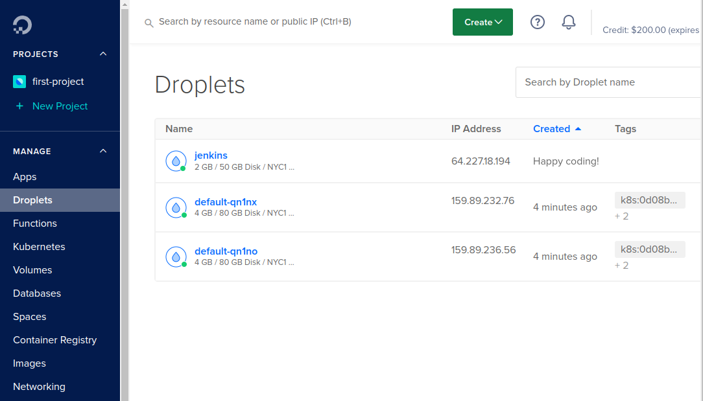

- ```sh
  ssh -i .ssh/digital_ocean_1 root@64.227.18.194
  ```

- Pra conectar ao cluster, baixar o arquivo de configuração fornecido e colar no `~/.kube/config`

  - 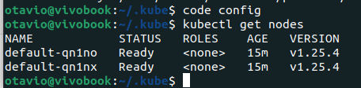
  - 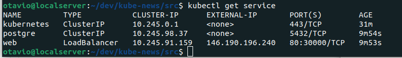
  - Esta maneira é via CLI e não é facilmente replicável. 
  - Acessando o load balancer pelo IP
    - 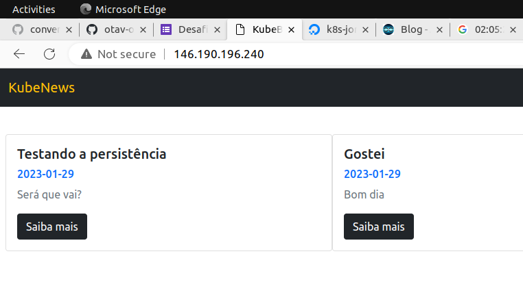

#### Usando Terraform

- Instalar o Terraform na sua máquina local

- Boa prática começar com o arquivo `main.tf`

- https://registry.terraform.io/

  - Repositório de providers. Cuidado com os da comunidade.
  - Tem o do Digital Ocean com documentação e setup inicial

- ```hcl
  terraform {
    required_providers {
      digitalocean = {
        source  = "digitalocean/digitalocean"
        version = "~> 2.0"
      }
    }
  }
  
  provider "digitalocean" {
    token = "<gerar personal access token>"
  }
  
  # copiar da documentação (terraform repository) e editar
  resource "digitalocean_droplet" "jenkins" {
    image  = "ubuntu-22-04-x64"
    name   = "jenkins"
    region = "nyc1"
    size   = "s-2vcpu-2gb"
    # observar que este campo foi declarado como data source no bloco seguinte
    ssh_keys = [data.digitalocean_ssh_key.jornada.id]
  }
  # vincular uma chave existente ao droplet
  data "digitalocean_ssh_key" "jornada" {
    name = "vivobook-key-1-jornadadevops"
  }
  
  resource "digitalocean_kubernetes_cluster" "meucluster" {
    name    = "meucluster"
    region  = "nyc1"
    version = "1.25.4-do.0"
  
    node_pool {
      name       = "default"
      size       = "s-2vcpu-2gb"
      node_count = 2
    }
  }
  ```
  
- ```sh
  terraform init
  ```

  - Inicializa o projeto
  - 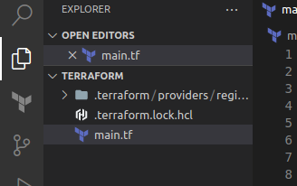
  
- ```bash
  terraform apply
  ```

  - Apresenta um plano de modificações e pede a confirmação
  - 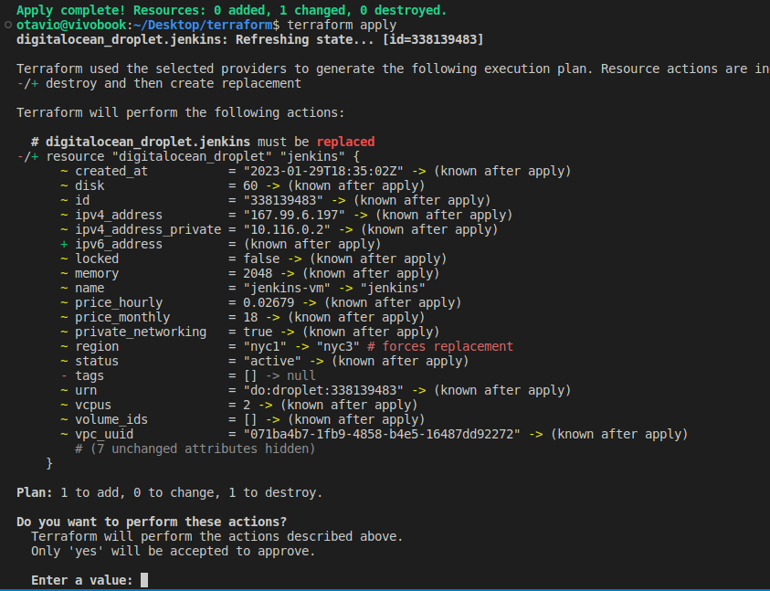

- `terraform.tfstate`: arquivo com informações do estado atual do projeto (preço por hora, endereço ip dos recursos, etc.) É criado após o apply

  - `terraform.tfstate.backup`: histórico dos estados

- `terraform fmt`: formata o código

- `terraform plan:` mostra o plano de execução mas não dá a opção de aplicar.

- `terraform init -upgrade`

- `terraform destroy`

  - Derruba toda a infraestrutura criada pelo projeto

- `terraform output`

- Observação: o código da aula está melhor do que mostrado neste exemplo, pois possui variáveis definidas em outro arquivo (`terraform.tfvars`)

## Aula 4

- Automação com Jenkins
- Pipeline (encanamento): condução do fluxo de tarefas na direção correta.
  - **Pipeline de integração continua (CI)**: lançar releases da aplicação. O controle da qualidade desde o commit do desenvolvedor até o deploy.
    - 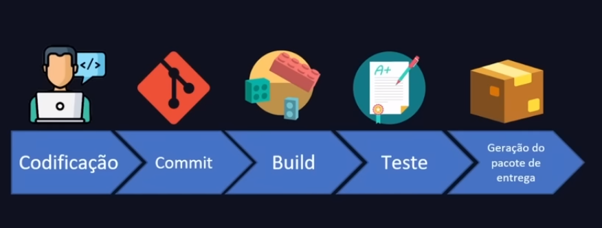
  - **Pipeline de Entrega Contínua (CD)**: entregar a release já feita. A partir do pacote da release.
    - 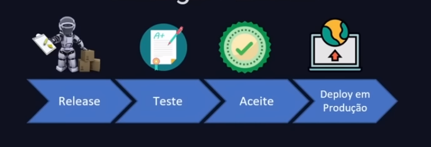

### Jenkins

- Opensource, lançado em 2005, escrito em Java, extensível (possui vários plugins), linguagem de pipeline feita em Groovy, interface amigável de gerenciamento, trabalha com múltiplos versionadores, pode ser usado em qualquer ambiente cloud, uma das soluções de pipeline mais utilizadas no mercado.
- Instalar na máquina, não em containers
- No cenário ideal: há os agentes (execução das pipelines) e o orquestrador, mas aqui usaremos apenas uma máquina

### Projeto da aula

- Disparar, a cada commit, a pipeline que vai gerar a imagem docker e entregar automaticamente no cluster kubernetes.

- Subir toda a infraestrutura com Terraform e acessar via ssh o ip do cluster

  - ```bash
    ssh -i ~/.ssh/digital_ocean_1 root@167.71.16.6
    apt update && apt install openjdk-17-jdk -y
    # seguir o restante da documentação do jenkins
    ```

- Instalar o docker e o kubectl

  - ```bash
    curl -fsSL https://get.docker.com | sh
    usermod -aG docker jenkins
    systemctl restart jenkins
    # instalar o kubectl
    ```

- Entrar no navegador pelo IP e na porta 8080. Configurar por lá

  - Instalar os plugins: Docker, Docker Pipeline, Kubernetes CLI
  - Configurar uma pipeline simples
    - 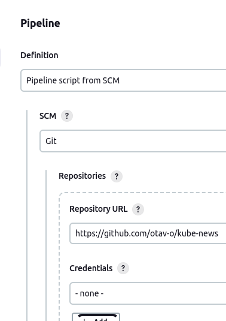

- [Acesse o código do Jenkinsfile aqui](https://github.com/otav-o/kube-news/blob/main/Jenkinsfile)
  - Adicionar as variáveis diretamente no console do Jenkins, sendo o kubeconfig o upload de um arquivo.
- 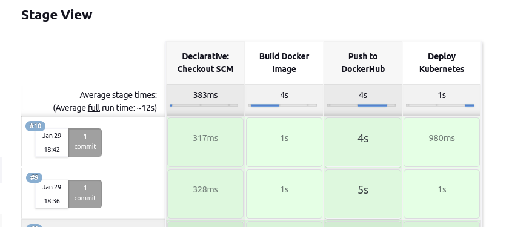
- 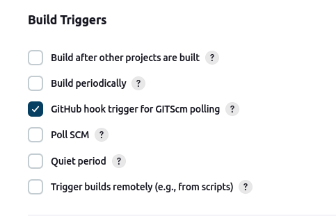
  - 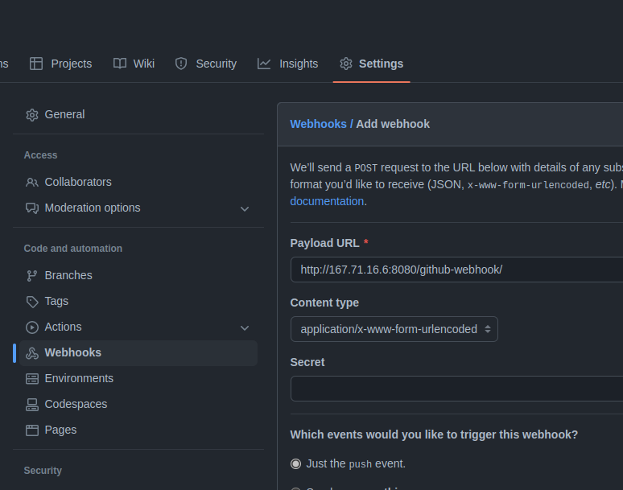
  - Build automático após o push

## Aula 5

### Métricas

- Coleta de parâmetros em formato numérico relacionado ao seu software ou infraestrutura

- Normalmente estes dados numéricos são relacionados a uma linha temporal

- Consumo de CPU, latência

- Métricas de sistema (infra e aplicação)

  - Quantidade de requisições, quantidade de erros, consumo de recursos, APIs mais acessadas, tempo de acesso a um recurso

- Métricas de negócio (usuário)

  - Usuários acessando a aplicação, boletos emitidos, compras de um produto
  - Precisa estar alinhada com as de sistema, também

- Métrica não é log

  - | Métrica                                            | Logs                                                         |
    | -------------------------------------------------- | ------------------------------------------------------------ |
    | Dados numéricos, gráficos, agregações, performance | Dados textuais, mensagens de erro, informação. São buscáveis |

### Prometheus 

- Criado pela SoundCloud, é open source
- Possui um TSDB (time series database): é independente
- Múltiplas formas de visualização (via API, com Grafana, etc.)
- Configuração de alertas
- Projeto graduado na CNCF (Cloud Native Computing Foundation), assim como o Kubernetes
  - Significa que é agnóstico quanto ao ambiente
- TSDB: blocos de linha temporal. Cada um representa 2h
  - É possível programar a compactação de dados (ex.: a cada 30 dias) - mas perde precisão
  - Adapters: armazenar em outros bancos, não está preso ao storage do Prometheus
- A aplicação expõe as métricas em um endpoint e o Prometheus vai lá e coleta. É uma busca, e não um envio
- Linguagens suportadas à exposição de métricas
  - Oficiais: Go, Java, Python, Ruby
  - Não-oficiais: Bash, C++, .NET, Node.js, etc.
- Suporte nativo: Grafana, Docker, Kubernetes
- Sem suporte nativo: MySQL, Jenkins, MongoDB
  - Tem que usar Exporters: uma mini aplicação de coleta de métricas.
- Processos rápidos e sem exposição de métricas ficam salvas em um push gateway, que depois são coletados pelo grafana
- Service Discovery: pegam o endereço IP dinamicamente
- Alertas
  - Alert Manager recebe os alertas do Prometheus
- 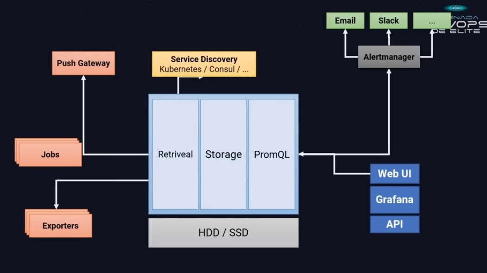
- Configuração em arquivo `.yml`
- Vamos rodar direto no cluster kubernetes
- 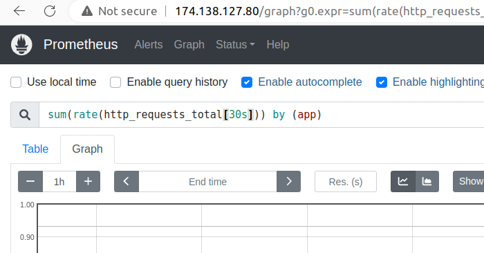
- 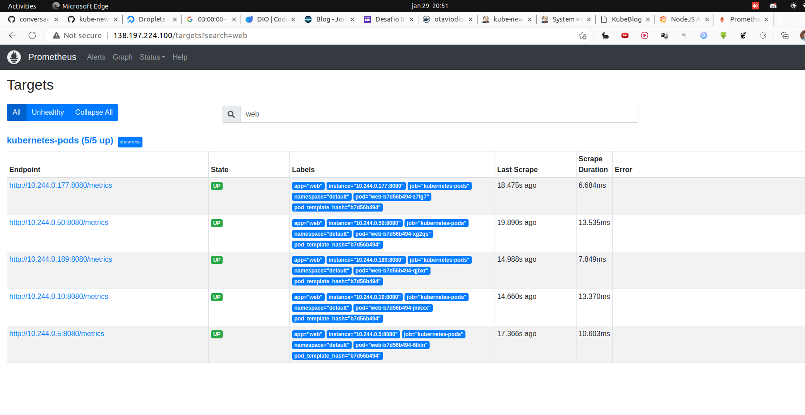

### Grafana 

- ```bash
  kubectl get secret grafana -o jsonpath="{.data.admin.password}" | base64 --decode ; echo
  ```

- 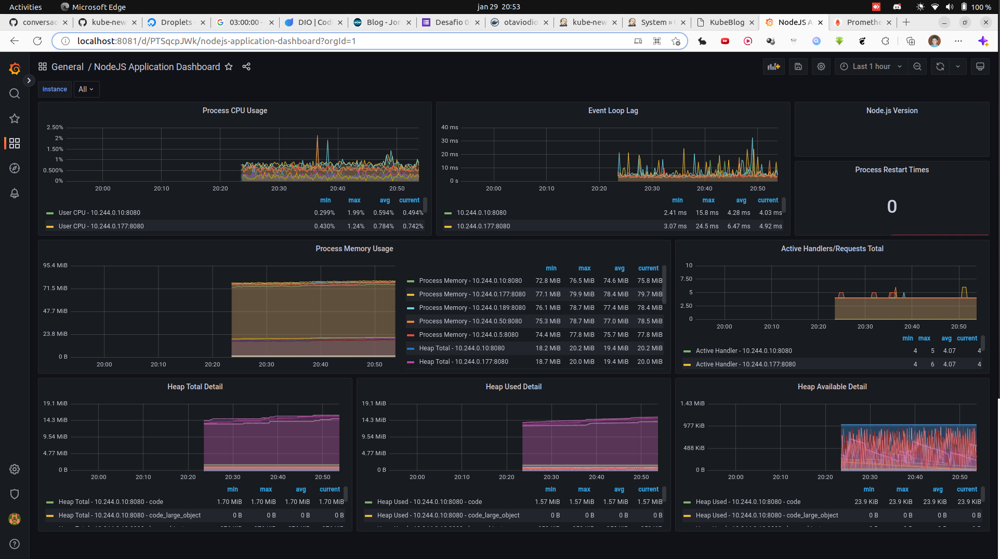

- 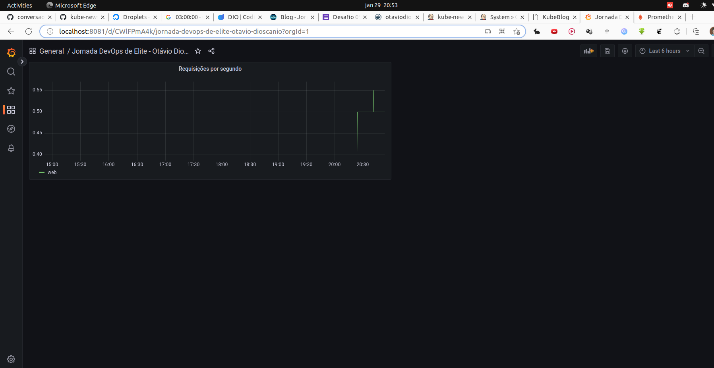

> fim das aulas em 29/01/2023, domingo, 20:55
>
> fui

## Live: Ansible

- Ferramenta que permite o setup (configuração) de várias máquinas pelo security shell (ssh). Não precisa ir manualmente rodar os scripts nas máquinas
  - Complementa o Terraform
  - Dá para fazer muita coisa: setar banco de dados, criar setup do seu próprio computador (se for Linux), configurar container Docker. Repleto de utilidades.
  - Baseado em Python.

### Conceitos importantes

#### Módulos

- Bloco de código que representa uma ação a ser executada

- Pode criar usuário, fazer uma instalação, criar diretório, fazer uma cópia, etc.

  - ```yml
    apt:
      update_cache: yes
      name: docker-ce
      state: present
    ```

#### Task

- Ação pontual utilizando um módulo

  - ```yml
    - name: Atualizando os repositórios e instalando o Docker
      apt:
        update_cache: yes
        name: docker-ce
        state: present
    ```

- Um conjunto de tarefas é um Play

#### Play

- Conjunto de Tasks com uma ordem específica

  - ```yml
    - name: Instalação do Docker
      hosts: jenkins
      remote_user: root
      tasks:
        - name: Instalação dos pré-requisitos
          apt:
            name: ca-certificates, curl, gnupg, lsb-release
            state: latest
            update_cache: yes
    
        - name: Adicionando a chave para o repositório APT
          apt_key:
          	repo: https://download.docker.com/linux/ubuntu/gpg
          	state: present
         
         # etc.     
    ```

- Um ou mais Plays fazem o arquivo Playbook

#### Inventário

- Arquivo que armazena os hosts que serão usados no PlayBook

- ```ini
  64.225.30.35
  
  [nginx]
  143.198.115.117
  
  [docker]
  167.172.29.187
  
  [docker:vars]
  ansible_ssh_private_key_file=~/.ssh/id_rsa
  ```

### Ansible Collection

- Mostra categorias e módulos
- Há módulos de provedores de cloud.

- https://docs.ansible.com/ansible/latest/collections/ansible/builtin/index.html
  - Ansible Buitin, apt

### Execução do PlayBook

- O Ansible precisa estar instalado na sua máquina (igual o Terraform)

- ```bash
  ansible-playbook -i hosts playbook.yml
  ```

  - ```ini
    [jenkins]
    198.211.97.186
    
    [jenkins:vars]
    ansible_ssh_private_key_file=~/.ssh/digital_ocean_1
    ansible_user=root
    ```

  - ```yaml
    - name: Instalação do Java
      hosts: jenkins # foi definido no arquivo de inventário. Poderia ser "all"
      remote_user: root
      tasks:
        - name: Instalando o Java
          ansible.builtin.apt: # Ver na documentação do Ansible Builtin
            name: openjdk-11-jdk
            state: present
            update_cache: yes
    
    - name: Instalação do Jenkins
      hosts: jenkins
      remote_user: root
      tasks:
        - name: Adicionar a chave do repositório
          ansible.builtin.apt_key:
            url: https://pkg.jenkins.io/debian-stable/jenkins.io.key
            state: present
    
        - name: Adicionando o repositório
          ansible.builtin.apt_repository:
            repo: "deb https://pkg.jenkins.io/debian-stable binary/"
            state: present
    
        - name: Instalando o Jenkins
          ansible.builtin.apt:
            name: jenkins
            state: present
            update_cache: yes
    ```

- 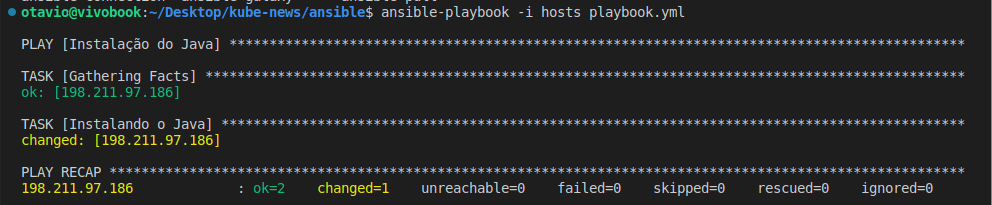

- Inventário dinâmico poderia executar o terraform e ansible em sequência

- Criar usuário, instalar plugins, definir credenciais e adicionar o repositório ao Jenkins ainda é uma tarefa manual.

- Repositório: https://github.com/otav-o/kube-news

  - Pastas: "terraform" e "ansible"

